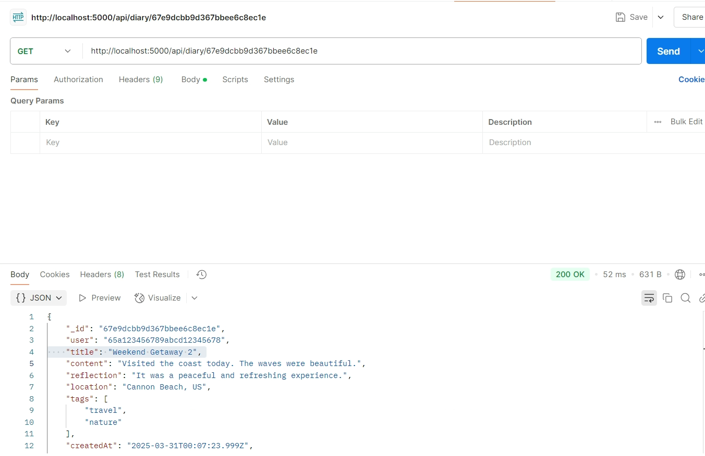
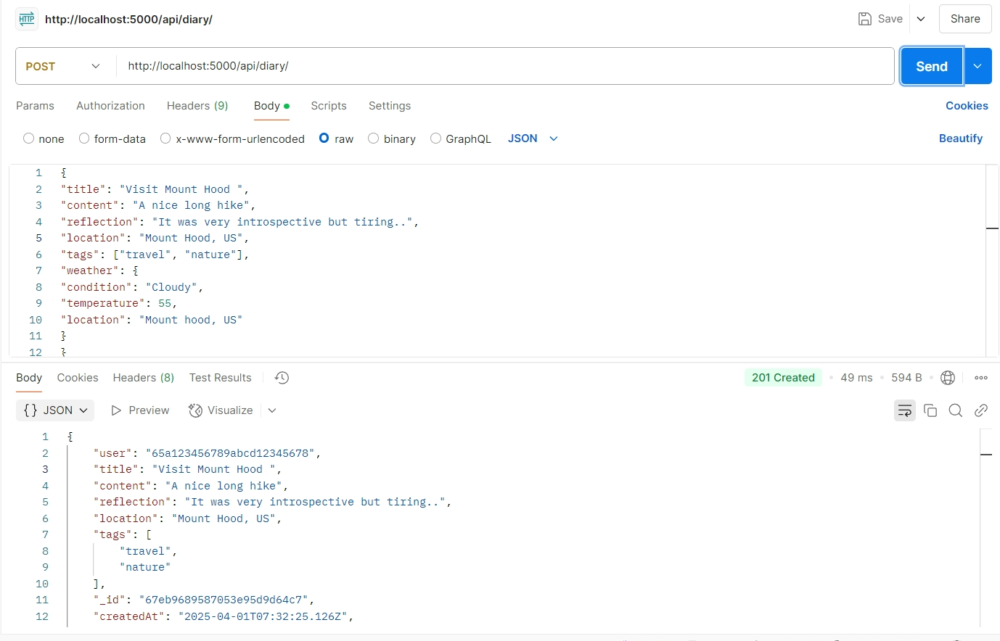
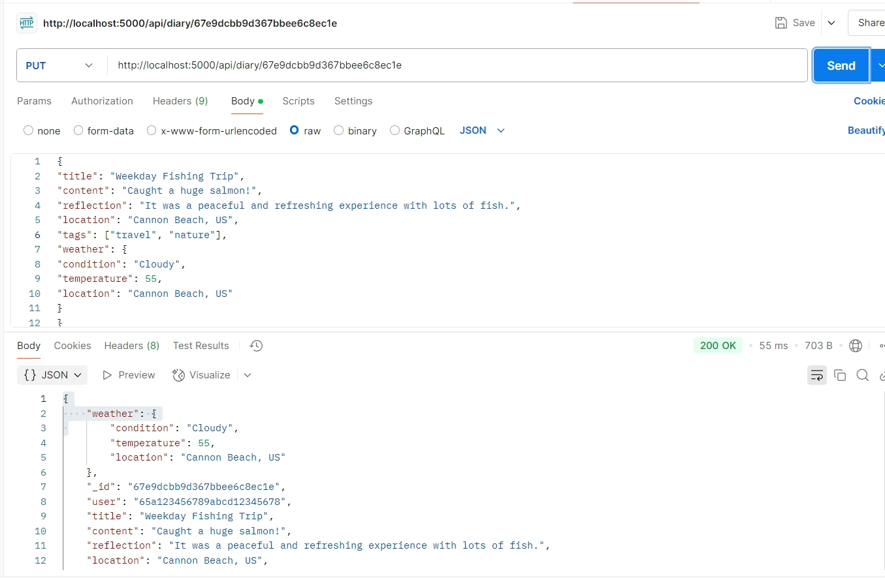
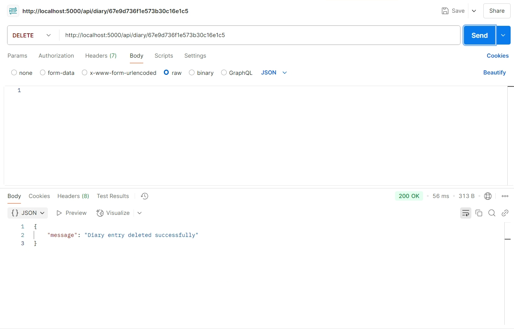
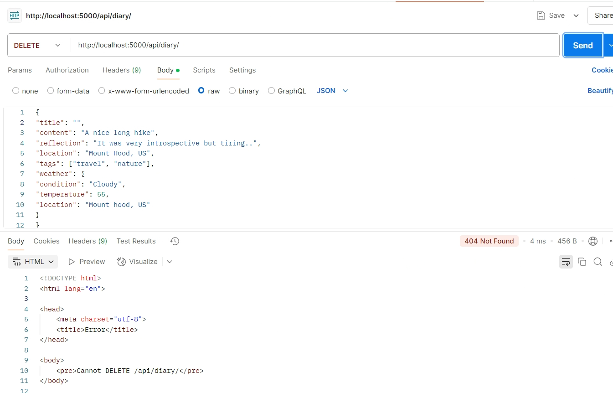

# FinalProject
<code>Jennifer Cruz</code>

## Project Overview: 

This projects relates to developing <code>ThoughtStream</code> which is a digital diary allowing users to reflect, record, and remember. This project is using the MERN stack (MongoDB, Express.js, React.js, and Node.js). 

Key features include allowing users to read, create, update, and delete diary entries.

<code> MERN stack</code>

- **MongoDB**: NoSQL database to store diary entries.

- **Express.js**: Web framework for handling server logic and API routes.

- **React.js**: Frontend framework for building the user interface.

- **Node.js**: JavaScript runtime for server-side work.

<code>Database</code>

The database contains the following schema:

- **_id**: `ObjectId` (Unique identifier, auto-generated by MongoDB)
- **user**: `ObjectId` (User who owns the diary entry)
- **title**: `String` (Title of the diary entry, required)
- **content**: `String` (Main body of the diary entry, required)
- **reflection**: `String` (User's reflection on the day, optional, max 500 characters)
- **location**: `String` (User-specified location, e.g., Vancouver, US)
- **createdAt**: `Date` (Timestamp when the entry was created, auto-generated)
- **updatedAt**: `Date` (Timestamp when the entry was last updated, auto-updated)
- **tags**: `[String]` (Array of tags for categorization, optional)

### Weather Data

- **weather**: `Object` (Auto-fetched weather data at the time of entry)
  - **weather.condition**: `String` (Description of the weather, e.g., "Sunny", "Rainy")
  - **weather.temperature**: `Number` (Temperature at the time of entry in °F)
  - **weather.location**: `String` (Location of the weather data, e.g., city name)

## Setup Instructions: 

 Ensure the latest version of Node and NPM is installed from 'https://nodejs.org/en'.  Check the version with <code> node -v, npm -v </code> 

 Once inside the directory, to install dependencies enter  <code> npm install express mongoose dotenv cors axios </code> 

 After cloning the repository to your local directory, once accessed please enter:
<code> npm install </code> 

To run the server, enter <code> npm run dev </code> to start the server with continuous updates, or <code> node server.js</code> to run the backend server

## API Usage Guide:

API usage guide along with available endpoints, example requests and their expected result:

<h2>Good Requests</h2>

 Fetch all the diary entries in the database:  
<code> GET http://localhost:5000/api/diary/</code>

 Or by ID:
<code> GET http://localhost:5000/api/diary/:id</code> 

 
 </img>

 Create a new diary entry:   
<code> POST http://localhost:5000/api/diary/</code> 
 </img>

 Update an existing diary entry with the ID:  
<code> PUT http://localhost:5000/api/diary/:id</code> 
 </img>

<h2>Bad Requests</h2>

 Delete a specific diary entry using the ID:  
<code> DELETE http://localhost:5000/api/diary/:id</code> 
 </img>

 POST request, no title provided:  
<code> POST http://localhost:5000/api/diary/</code> 
 </img>

 DELETE request, no ID provided  
<code> DELETE http://localhost:5000/api/diary/</code> 
 </img>

<h2>Error Codes or responses:</h2> 

200 OK: The server has processed the request.

201 Created: The server processed the request and created a new entry.

400 Bad Request: If the input is invalid.

404 Not Found: Requested entry or information was not found.

500 Internal Server Error: If there is a server issue.
 

## Environment Variables:

A .env was excluded from the repository as it contained sensitive information, an EXAMPLE.env has been provided, simply replace the placeholder fields with the correct username and password.

 
MONGO_URI: MongoDB connection URI, for example:
<code> mongodb://localhost:27017/your-db-name </code>

PORT: 5000, for example the server would be hosted on: <code> http://localhost:5000/ </code>

NODE_ENVIROMENT: Refers to the developmental mode or production mode.

## Common Issues & Debugging Tips:
<h3>#1 Hardcoded user variable </h3>

The variable for the user in diaryController.js is hardcoded as to avoid any authentication errors. Currently it is set to <code>65a123456789abcd12345678 </code> This is only hardcoded for testing purposes in Part One of the project.

<h3>#2 Temporary reassignment of weather data </h3>

For testing purpose in Part One, the weather variable is set to the location data, instead of using the fetch weather API. This is a temporary issue and is only used for testing purposes. After ensuring success, the weather variable was then set to a fetch from the OpenWeather API

## API Testing Results

 Included in the API usage guide.

## Extra Credit: 

## Git Commit History:
commit ebd3654171b3d7256c1d9873612fa5ce101739f5
Author: Jennifer Cruz <jennifer.cruz3@wsu.edu>
Date:   Tue Apr 1 01:44:00 2025 -0700

    Update README.md for API testing

commit 8396144ccab8bb57dbceb3ed8fce3cbfeef2b4c6
Author: Jennifer Cruz <jennifer.cruz3@wsu.edu>
Date:   Tue Apr 1 01:43:02 2025 -0700

    Update delete endpoint in diaryRoutes.js

commit 137786182a81ce0f1eb0801c0200e26c71edc805
Author: Jennifer Cruz <jennifer.cruz3@wsu.edu>
Date:   Tue Apr 1 01:42:39 2025 -0700

    Update updateEntry() in diaryController.js to work

commit ef539e715b9ca5bb2db618acd07b0893b458e427
Author: Jennifer Cruz <jennifer.cruz3@wsu.edu>
Date:   Sun Mar 30 17:46:12 2025 -0700

    Implement basic server for testing in server.js

commit 72a8f6a1abc23a17099c352815e34b5c8e2ee6a1
Author: Jennifer Cruz <jennifer.cruz3@wsu.edu>
Date:   Sun Mar 30 17:44:21 2025 -0700

    Update README.md w/ overview & instructions

commit 0ca7fbb7c430b3d056b1dee7da12077a3211abd9
Author: Jennifer Cruz <jennifer.cruz3@wsu.edu>
Date:   Sun Mar 30 17:43:41 2025 -0700

    Hardcode user id to for testing in diaryController.js

commit fbd4491646d0a72c85efcae1b689e38bd8400a3d
Merge: c39b478 0d667b8
Author: Jennifer Cruz <jennifer.cruz3@wsu.edu>
Date:   Sun Mar 30 15:30:46 2025 -0700

    Merge pull request #2 from jencruzcallejas/API
    
    Api Functionalities

commit 0d667b86c5ebd550103588a7e97f49c946f33079
Author: Jennifer Cruz <jennifer.cruz3@wsu.edu>
Date:   Sun Mar 30 15:30:06 2025 -0700

    Implement updateEntry & deleteEntry in diaryController.js
    
    - also updated createEntry to check title and content

commit 52295c1ad7e2c76efec2d599fd4f51ce9fa801e1
Author: Jennifer Cruz <jennifer.cruz3@wsu.edu>
Date:   Sun Mar 30 00:47:54 2025 -0700

    Update CRUD operations in diaryRoutes.js

commit 2e625e3400e6380c6bce5fb886be3e3fd1968626
Author: Jennifer Cruz <jennifer.cruz3@wsu.edu>
Date:   Sat Mar 29 23:34:34 2025 -0700

    Implement API routes in diaryRoutes.js

commit c39b478ae6f0016b2291e9cb9d5d3a80709a268b
Merge: b6cda1d 5d99191
Author: Jennifer Cruz <jennifer.cruz3@wsu.edu>
Date:   Sat Mar 29 23:31:34 2025 -0700

    Merge pull request #1 from jencruzcallejas/dataModel
    
    Create data model

commit 5d991914c338ac3fe19126e53a80b3aa86c2fce5
Author: Jennifer Cruz <jennifer.cruz3@wsu.edu>
Date:   Sat Mar 29 23:31:02 2025 -0700

    Create diaryRoutes.js

commit d069cd4d990b9f9329f420a68a7c956c65b75825
Author: Jennifer Cruz <jennifer.cruz3@wsu.edu>
Date:   Sat Mar 29 23:30:52 2025 -0700

    Update package.json w/ desc. and dependencies

commit 69356b29ac29625708f0a400c301fb44a0952420
Author: Jennifer Cruz <jennifer.cruz3@wsu.edu>
Date:   Sat Mar 29 23:30:07 2025 -0700

    Move db.js to \config

commit c491dcafd844142f7ff288a783cb35965c144999
Author: Jennifer Cruz <jennifer.cruz3@wsu.edu>
Date:   Sat Mar 29 23:29:22 2025 -0700

    Create controller for app. logic in diaryController.js

commit 893d6356305ab6e1248b8a1fe851f1eaa6344226
Author: Jennifer Cruz <jennifer.cruz3@wsu.edu>
Date:   Sat Mar 29 23:28:32 2025 -0700

    Connect server to MongoDB in serverjs

commit e256059744719e0cd007a9f11660b8d00ced61eb
Author: Jennifer Cruz <jennifer.cruz3@wsu.edu>
Date:   Sat Mar 29 23:24:08 2025 -0700

    Configure database connection in db.js

commit 403c27e147c87dfa7023c64b6d7f715b0b6c2efb
Author: Jennifer Cruz <jennifer.cruz3@wsu.edu>
Date:   Sat Mar 29 23:22:47 2025 -0700

    define schema in DiaryEntry.js

commit b6cda1d865d730b890656e7f911a1e3558c47d88
Author: Jennifer Cruz <jennifer.cruz3@wsu.edu>
Date:   Sat Mar 29 19:24:46 2025 -0700

    set up project and organize codebase
    
    -create necessary directories
    -create the setup and installation

commit 7381bfb969976494d28de6d14460533b7b8b21dc
Author: Jennifer Cruz <jennifer.cruz3@wsu.edu>
Date:   Sat Mar 29 15:46:45 2025 -0700

    Initial commit 
    
