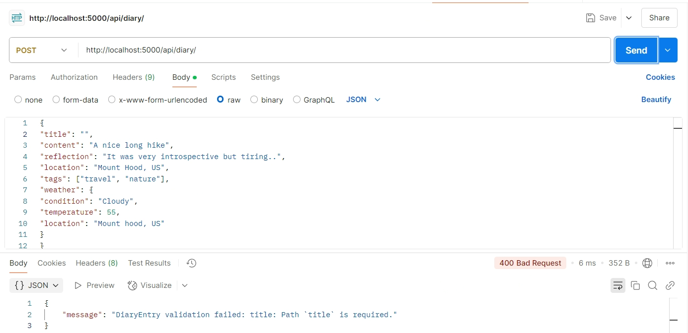

# FinalProject
<code>Jennifer Cruz</code>

## Project Overview: 

This projects relates to developing <code>ThoughtStream</code> which is a digital diary allowing users to reflect, record, and remember. This project is using the MERN stack (MongoDB, Express.js, React.js, and Node.js). 

Key features include allowing users to read, create, update, and delete diary entries.

<code> MERN stack</code>

- **MongoDB**: NoSQL database to store diary entries.

- **Express.js**: Web framework for handling server logic and API routes.

- **React.js**: Frontend framework for building the user interface.

- **Node.js**: JavaScript runtime for server-side work.

<code>Database</code>

The database contains the following schema:

- **_id**: `ObjectId` (Unique identifier, auto-generated by MongoDB)
- **user**: `ObjectId` (User who owns the diary entry)
- **title**: `String` (Title of the diary entry, required)
- **content**: `String` (Main body of the diary entry, required)
- **reflection**: `String` (User's reflection on the day, optional, max 500 characters)
- **location**: `String` (User-specified location, e.g., Vancouver, US)
- **createdAt**: `Date` (Timestamp when the entry was created, auto-generated)
- **updatedAt**: `Date` (Timestamp when the entry was last updated, auto-updated)
- **tags**: `[String]` (Array of tags for categorization, optional)

### Weather Data

- **weather**: `Object` (Auto-fetched weather data at the time of entry)
  - **weather.condition**: `String` (Description of the weather, e.g., "Sunny", "Rainy")
  - **weather.temperature**: `Number` (Temperature at the time of entry in °F)
  - **weather.location**: `String` (Location of the weather data, e.g., city name)

## Setup Instructions: 

 Ensure the latest version of Node and NPM is installed from 'https://nodejs.org/en'.  Check the version with <code> node -v, npm -v </code> 

 Once inside the directory, to install dependencies enter  <code> npm install express mongoose dotenv cors axios </code> 

 After cloning the repository to your local directory, once accessed please enter:
<code> npm install </code> 

To run the server, enter <code> npm run dev </code> to start the server with continuous updates, or <code> node server.js</code> to run the backend server

## API Usage Guide:

API usage guide along with available endpoints, example requests and their expected result:

<h2>Good Requests</h2>

 Fetch all the diary entries in the database:  
<code> GET http://localhost:5000/api/diary/</code>

 Or by ID:
<code> GET http://localhost:5000/api/diary/:id</code> 

 
 </img>

 Create a new diary entry:   
<code> POST http://localhost:5000/api/diary/</code> 
 </img>

 Update an existing diary entry with the ID:  
<code> PUT http://localhost:5000/api/diary/:id</code> 
 </img>

<h2>Bad Requests</h2>

 Delete a specific diary entry using the ID:  
<code> DELETE http://localhost:5000/api/diary/:id</code> 
 </img>

 POST request, no title provided:  
<code> POST http://localhost:5000/api/diary/</code> 
 </img>

 DELETE request, no ID provided  
<code> DELETE http://localhost:5000/api/diary/</code> 
 </img>

<h2>Error Codes or responses:</h2> 

200 OK: The server has processed the request.

201 Created: The server processed the request and created a new entry.

400 Bad Request: If the input is invalid.

404 Not Found: Requested entry or information was not found.

500 Internal Server Error: If there is a server issue.
 

## Environment Variables:

A .env was excluded from the repository as it contained sensitive information, an EXAMPLE.env has been provided, simply replace the placeholder fields with the correct username and password.

 
MONGO_URI: MongoDB connection URI, for example:
<code> mongodb://localhost:27017/your-db-name </code>

PORT: 5000, for example the server would be hosted on: <code> http://localhost:5000/ </code>

NODE_ENVIROMENT: Refers to the developmental mode or production mode.

## Common Issues & Debugging Tips:
<h3>#1 Hardcoded user variable </h3>

The variable for the user in diaryController.js is hardcoded as to avoid any authentication errors. Currently it is set to <code>65a123456789abcd12345678 </code> This is only hardcoded for testing purposes in Part One of the project.

<h3>#2 Temporary reassignment of weather data </h3>

For testing purpose in Part One, the weather variable is set to the location data, instead of using the fetch weather API. This is a temporary issue and is only used for testing purposes.

## API Testing Results

 Included in the API usage guide.

## Extra Credit: 

## Git Commit History:

